# JobKo

This project is an Android application built using XML and Kotlin, based on a Figma design. The UI was carefully implemented to match the design, focusing on clean, responsive layouts, and a smooth user experience.

## 📸 Screenshots

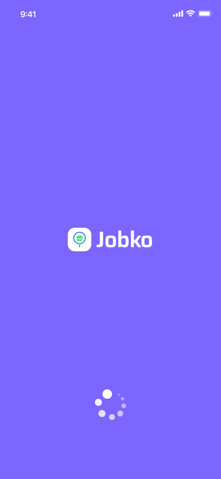
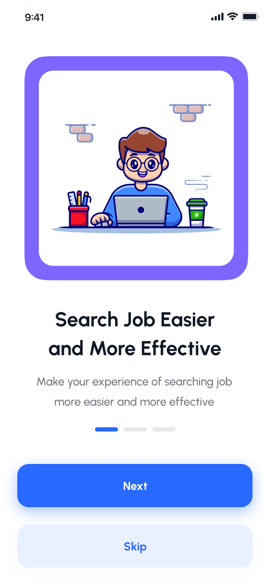
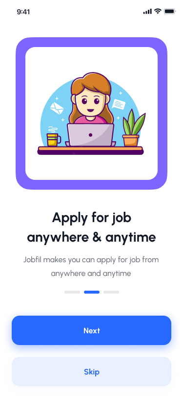
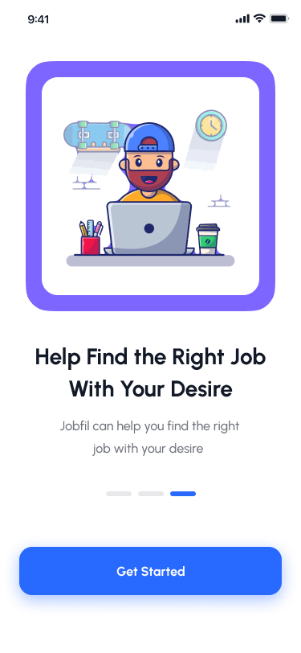
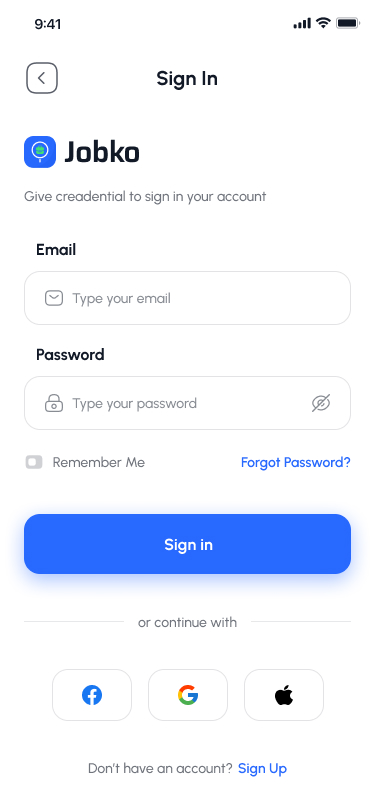
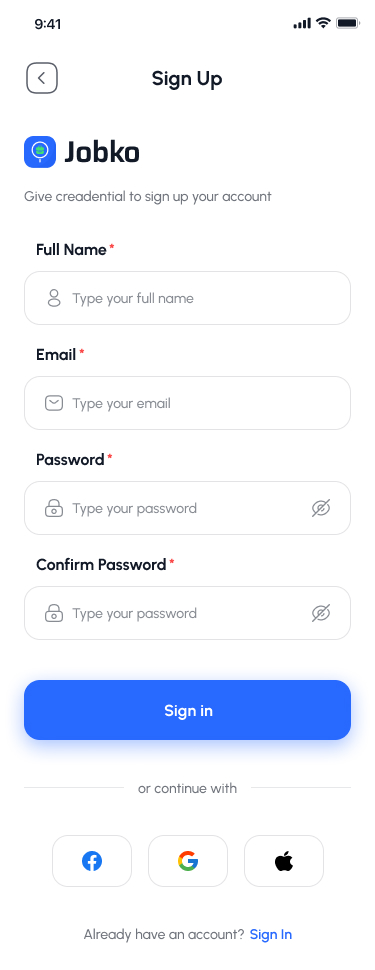
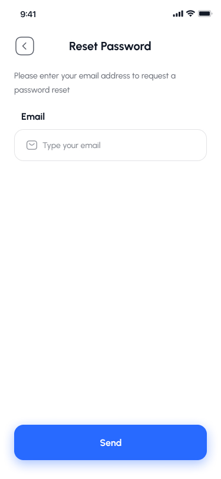
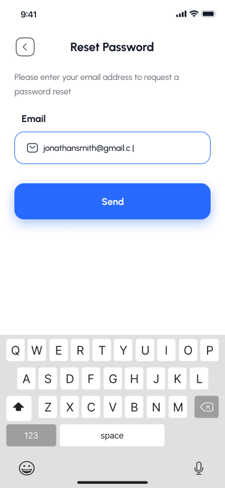
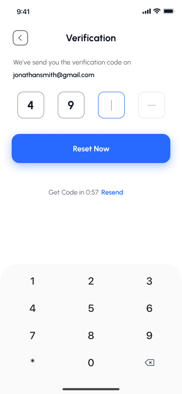
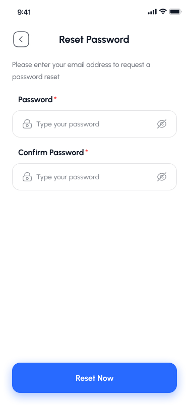
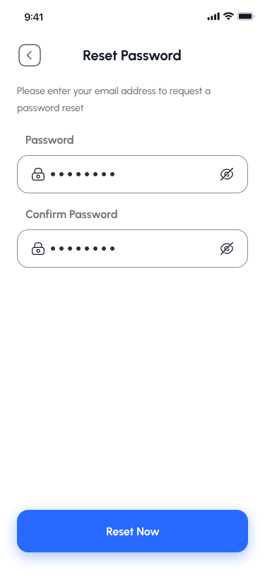
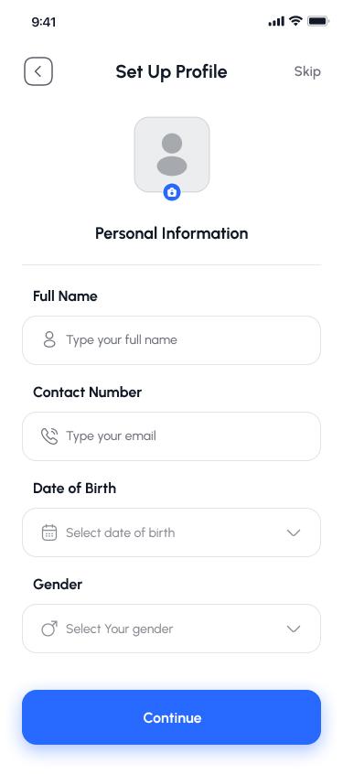
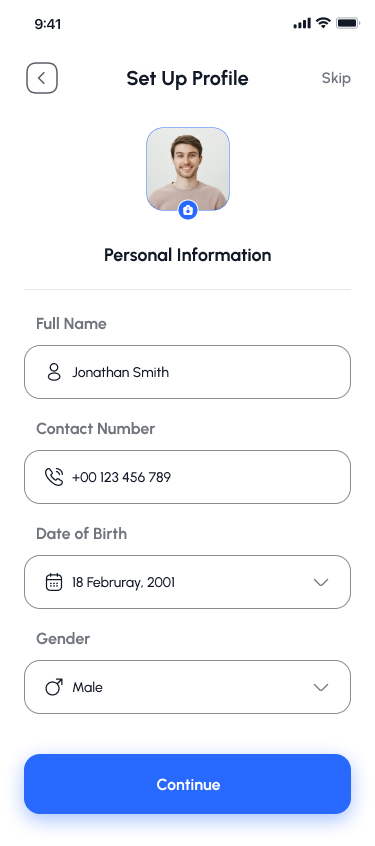
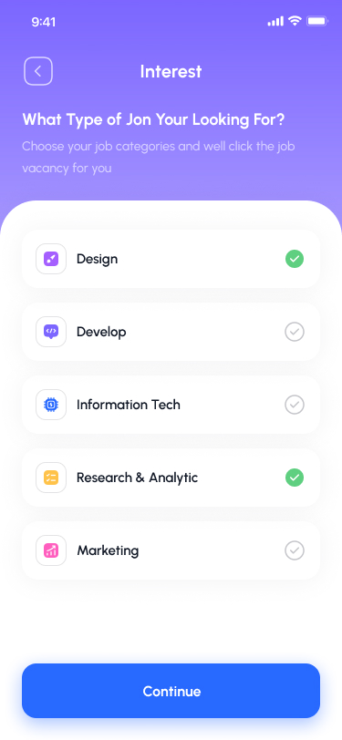
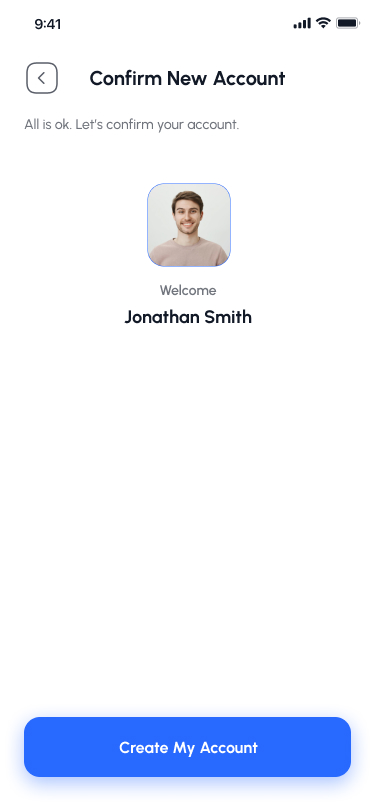
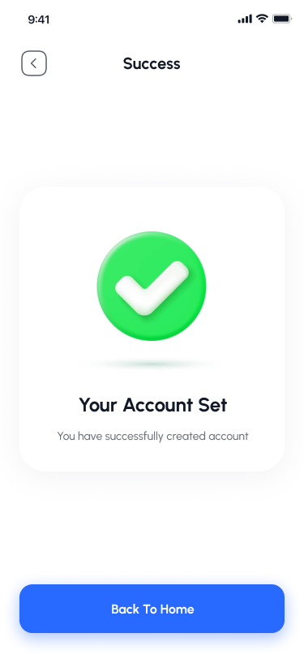
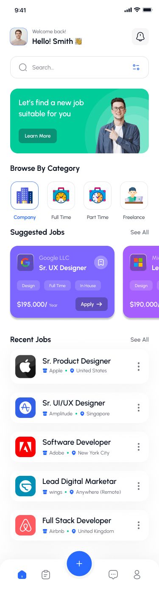
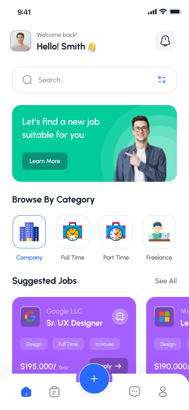
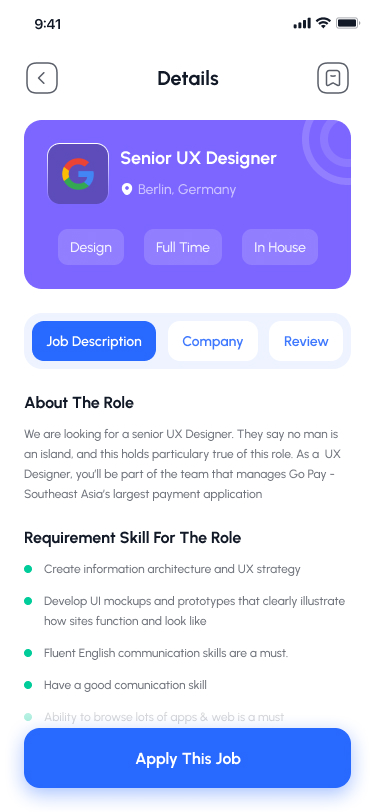
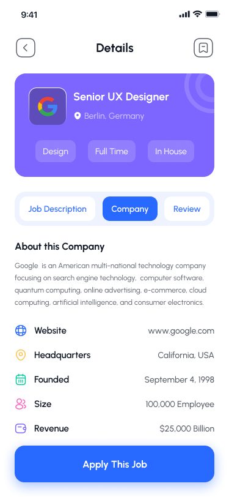

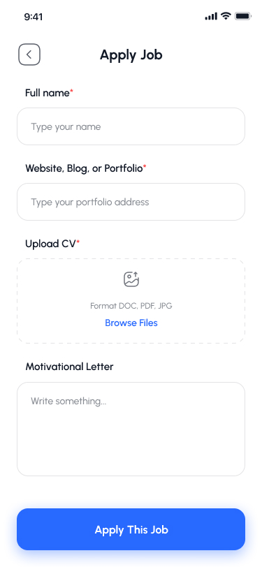
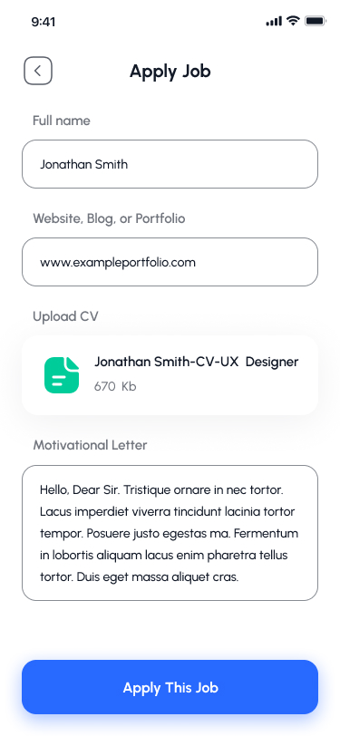
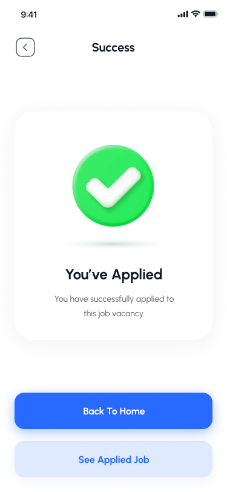
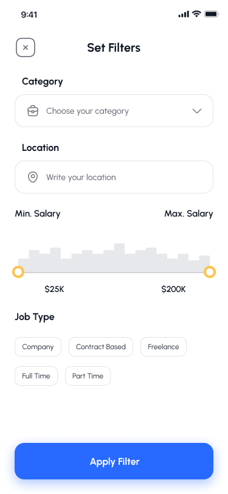
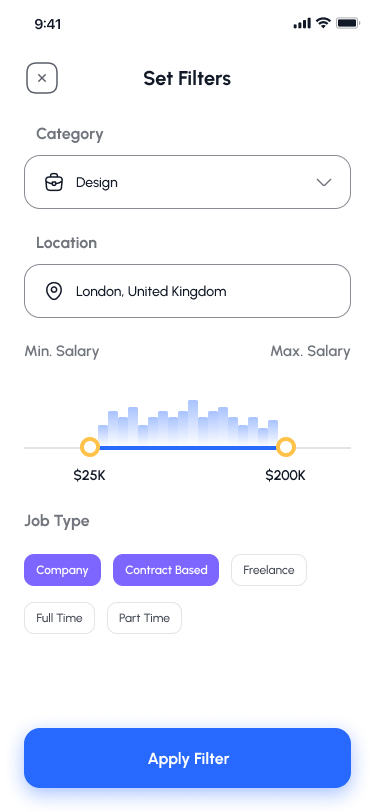
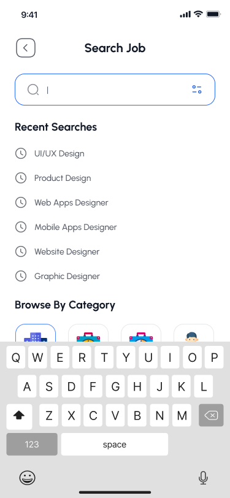
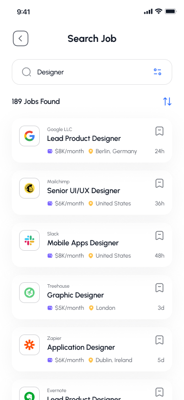

